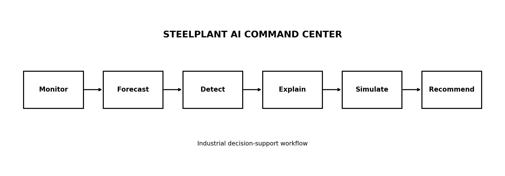

# 🏭 SteelPlant AI Command Center

### Industrial Energy & Gas Intelligence Platform

**Monitor • Forecast • Detect • Explain • Simulate • Recommend**

SteelPlant AI Command Center is an end-to-end industrial analytics and AI decision-support prototype designed to analyze energy and gas consumption across multiple industrial units.

Rather than functioning as a conventional dashboard, the project combines **operational monitoring, machine learning, anomaly detection, explainability, scenario simulation, and engineering-oriented recommendations** into a single workflow.

> **Note:** This project uses entirely synthetic data and is not based on confidential or proprietary SAIL data. The project is inspired by industrial energy-management problem statements and is intended for portfolio and educational purposes.

---

## 🚀 Project Overview

Industrial plants generate large amounts of operational data, but identifying abnormal consumption and converting analytics into actionable decisions requires more than visualization.

This project implements the following workflow:

**Monitor → Forecast → Detect Anomalies → Explain Drivers → Simulate Savings → Prioritize Actions**

The system enables users to:

* Monitor plant-wide energy and gas KPIs
* Compare energy intensity across production units
* Forecast upcoming energy consumption
* Detect unusual consumption patterns
* Identify important predictive drivers
* Simulate potential efficiency improvements
* Generate an engineering-oriented action queue

---

## 📸 Project Screenshots

### 🖥️ AI Command Center

Add your main dashboard screenshot here:

```markdown

```

### 📊 Energy & Intensity Analytics

```markdown

```

### 🚨 Anomaly Radar

```markdown

```

### 🤖 AI / Explainability

```markdown

```

### 🔄 System Workflow



> **Tip:** Replace `YOUR_DASHBOARD_FILENAME.png`, `YOUR_ANALYTICS_FILENAME.png`, etc. with the exact filenames you placed inside `assets/`.

---

## ✨ Key Features

### 1. Control Room

Provides a plant-wide operational overview through key performance indicators.

Metrics include:

* Total energy consumption
* Gas consumption
* Production output
* Energy intensity
* Gas intensity
* Unit-level performance

---

### 2. Intensity Analytics

Normalizes consumption against production to enable meaningful comparison between industrial units.

```text
Energy Intensity = Energy Consumption / Production

Gas Intensity    = Gas Consumption / Production
```

This helps distinguish higher consumption caused by increased production from potentially inefficient operation.

---

### 3. Energy Forecasting

A machine-learning forecasting pipeline predicts upcoming energy consumption using operational and temporal features.

**Model:**

* Random Forest Regressor

**Features include:**

* Production
* Equipment load
* Ambient temperature
* Humidity
* Previous-day consumption
* Lag features
* Rolling statistics
* Temporal features

The model uses **chronological hold-out validation** to avoid randomly mixing historical and future observations.

---

### 4. Anomaly Radar

Uses **Isolation Forest** to identify potentially abnormal consumption behavior.

The anomaly layer considers operational patterns such as:

* Energy intensity
* Gas intensity
* Production
* Equipment load
* Environmental conditions

Detected observations are surfaced for further engineering investigation rather than being treated automatically as confirmed equipment faults.

---

### 5. Explainability

The forecasting model is supplemented with **permutation importance** to identify which features have the greatest influence on predictive performance.

This provides additional visibility into questions such as:

> Which operational variables are most important when predicting energy consumption?

The explainability layer is intended to support engineering analysis rather than replace domain expertise.

---

### 6. What-If Efficiency Simulator

The simulator allows users to modify selected operating assumptions and estimate their potential effect on energy consumption.

Example scenarios:

* Production adjustment
* Equipment load reduction
* Efficiency improvement
* Operational optimization

The simulator provides estimated:

* Energy reduction
* Consumption change
* Potential savings
* Percentage improvement

These are **scenario estimates**, not guaranteed real-world savings.

---

### 7. Engineering Action Queue

The system converts analytical signals into a prioritized list of potential investigation areas.

Example actions may include:

* Investigate abnormal energy intensity
* Review high-load operating periods
* Examine recurring consumption spikes
* Evaluate efficiency improvement opportunities
* Compare unit-level performance

The action queue is designed as a **decision-support layer**, not an automated plant-control system.

---

## 🏗️ System Architecture

```text
                    ┌─────────────────────┐
                    │   Synthetic Data    │
                    │  2024–2025 Records  │
                    └──────────┬──────────┘
                               │
                               ▼
                    ┌─────────────────────┐
                    │ Data Preprocessing   │
                    │ & Feature Engineering│
                    └──────────┬──────────┘
                               │
               ┌───────────────┼────────────────┐
               ▼               ▼                ▼
        ┌─────────────┐ ┌─────────────┐ ┌─────────────┐
        │ KPI /       │ │ Forecasting │ │  Anomaly    │
        │ Intensity   │ │ Random      │ │  Detection  │
        │ Analytics   │ │ Forest      │ │ Isolation   │
        └──────┬──────┘ └──────┬──────┘ │ Forest      │
               │               │         └──────┬──────┘
               │               ▼                │
               │       ┌─────────────────┐      │
               │       │ Explainability  │      │
               │       │ Permutation     │      │
               │       │ Importance      │      │
               │       └────────┬────────┘      │
               │                │               │
               └────────────────┼───────────────┘
                                ▼
                    ┌─────────────────────┐
                    │  What-If Simulator  │
                    └──────────┬──────────┘
                               ▼
                    ┌─────────────────────┐
                    │ Engineering Action  │
                    │       Queue         │
                    └─────────────────────┘
```

---

## 📁 Project Structure

```text
SteelPlant_AI_Command_Center/
│
├── app.py
├── requirements.txt
├── README.md
├── .gitignore
│
├── data/
│   └── synthetic_steelplant_data.csv
│
└── assets/
    ├── workflow.png
    ├── dashboard.png
    ├── analytics.png
    ├── anomaly-detection.png
    └── ai-insights.png
```

> The screenshot filenames above are examples. Keep only the filenames that actually exist in your `assets/` folder.

---

## 📊 Dataset

The repository contains:

**2,920 synthetic daily observations**

covering:

**2024–2025**

across:

**4 representative industrial units**

The dataset is designed to resemble an industrial energy-management environment while remaining completely synthetic.

### Important

This dataset:

* Is not SAIL data
* Does not contain confidential plant information
* Does not represent actual SAIL operations
* Is intended only for demonstration, experimentation, and portfolio purposes

---

## 🧠 Machine Learning Pipeline

### Forecasting

```text
Raw Data
   ↓
Cleaning
   ↓
Feature Engineering
   ↓
Lag & Rolling Features
   ↓
Chronological Train/Test Split
   ↓
Random Forest Regressor
   ↓
Forecast Evaluation
```

### Anomaly Detection

```text
Operational Features
        ↓
Feature Preparation
        ↓
Isolation Forest
        ↓
Normal / Anomalous Classification
        ↓
Engineering Investigation Queue
```

### Explainability

```text
Trained Forecasting Model
          ↓
Permutation Importance
          ↓
Feature Contribution Analysis
          ↓
Operational Interpretation
```

---

## 🛠️ Tech Stack

| Technology   | Purpose                 |
| ------------ | ----------------------- |
| Python       | Core development        |
| Pandas       | Data manipulation       |
| NumPy        | Numerical computing     |
| Scikit-learn | Machine learning        |
| Streamlit    | Interactive application |
| Matplotlib   | Data visualization      |

---

## ⚙️ Installation

### 1. Clone the repository

```bash
git clone https://github.com/deepeshkumar81311/steelplant-ai-command-center.git
cd steelplant-ai-command-center
```

### 2. Create a virtual environment

#### Windows

```bash
python -m venv .venv
```

Activate it:

```bash
.venv\Scripts\activate
```

#### Linux / macOS

```bash
python3 -m venv .venv
source .venv/bin/activate
```

### 3. Install dependencies

```bash
pip install -r requirements.txt
```

### 4. Run the application

```bash
streamlit run app.py
```

The Streamlit application will open in your browser.

---

## 📋 Application Modules

| Module              | Method                 | Purpose                        |
| ------------------- | ---------------------- | ------------------------------ |
| Control Room        | KPI Engineering        | Plant-wide monitoring          |
| Intensity Analytics | Normalization          | Unit comparison                |
| Forecast            | Random Forest          | Energy demand forecasting      |
| Anomaly Radar       | Isolation Forest       | Abnormal consumption screening |
| Explainability      | Permutation Importance | Driver analysis                |
| What-If Simulator   | Scenario Modelling     | Efficiency analysis            |
| Action Queue        | Rule-Based Logic       | Investigation prioritization   |

---

## 🎯 Design Goals

### Operational Relevance

Analytics should correspond to real industrial operating questions.

### Production Normalization

Consumption should be evaluated relative to production rather than only using absolute values.

### Machine Learning Assistance

ML models should identify patterns that may be difficult to detect through simple visualization.

### Explainability

Model outputs should provide interpretable information for engineering users.

### Decision Support

The final output should help identify areas requiring investigation instead of stopping at model predictions.

---

## 🔮 Future Improvements

Possible extensions include:

* Real-time sensor integration
* SCADA / historian data integration
* Advanced time-series forecasting
* Equipment-level anomaly detection
* SHAP-based explainability
* Automated alerting
* PostgreSQL / TimescaleDB integration
* REST API for model inference
* Model monitoring and drift detection
* Docker deployment
* Cloud deployment
* Integration with authorized plant datasets

---

## ⚠️ Data & Usage Disclaimer

This project is a **portfolio and educational prototype**.

All included industrial data is synthetic and should not be interpreted as actual plant measurements or operational information.

The system demonstrates:

* Data analytics
* Machine learning
* Industrial KPI engineering
* Anomaly detection
* Explainable AI
* Scenario modelling
* Decision-support workflows

It is **not intended for direct control of industrial equipment or safety-critical operations**.

---

## 👨‍💻 Author

**Deepesh Kumar**

Chemical Engineering — NIT Rourkela

### Interests

* Machine Learning
* Artificial Intelligence
* Industrial Analytics
* Process Engineering
* Energy Optimization
* Data-Driven Decision Systems

---

## 🚀 Live Demo

### Try the SteelPlant AI Command Center

**[🔴 Launch Live Application](https://deepeshkumar81311-steelplant-ai-command-center-app-tue1zv.streamlit.app/)**

Experience the complete interactive industrial analytics dashboard directly in your browser.

---

## 🔗 Project Links

| Resource                 | Link                                                                                                   |
| ------------------------ | ------------------------------------------------------------------------------------------------------ |
| 🚀 **Live Demo**         | [Open Streamlit App](https://deepeshkumar81311-steelplant-ai-command-center-app-tue1zv.streamlit.app/) |
| 💻 **GitHub Repository** | [View Source Code](https://github.com/deepeshkumar81311/steelplant-ai-command-center)                  |

---

### ⚡ Quick Start

**Live application:**
https://deepeshkumar81311-steelplant-ai-command-center-app-tue1zv.streamlit.app/

**Source code:**
https://github.com/deepeshkumar81311/steelplant-ai-command-center
